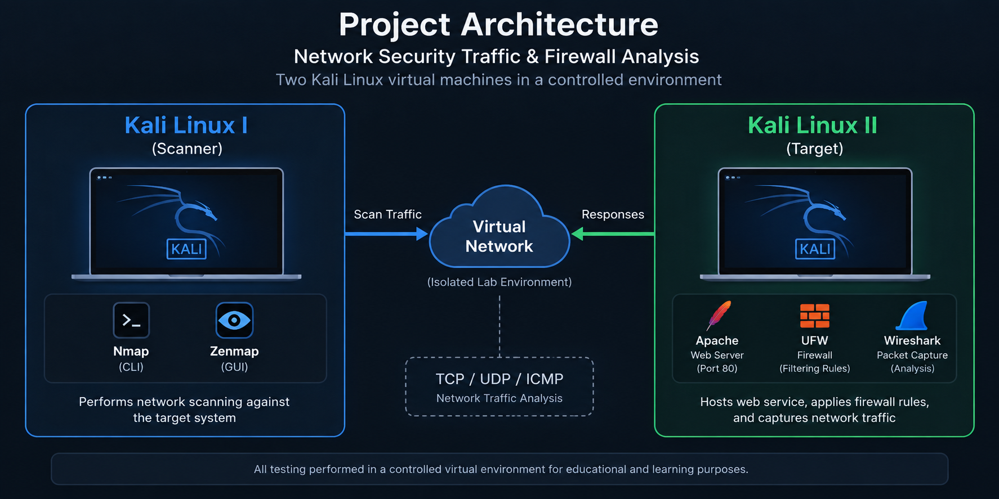

# 🔐 Network Security Traffic & Firewall Analysis

> **Hands-on network security project** exploring network reconnaissance, TCP/IP packet behavior, traffic analysis, and the impact of host-based firewall filtering in a controlled virtual environment.

This project uses **two Kali Linux virtual machines** to analyze how different network scanning techniques behave at the packet level.

**Kali Linux I** acts as the **scanner** using **Nmap/Zenmap**, while **Kali Linux II** acts as the **target**, running an **Apache web service**, capturing traffic with **Wireshark**, and applying **UFW firewall rules**.

---

## 📌 Project Summary

| | |
|---|---|
| **Environment** | Two Kali Linux virtual machines |
| **Focus** | Network Scanning, Packet Analysis & Firewall Testing |
| **Core Tools** | Nmap, Zenmap, Wireshark, UFW & Apache |
| **Testing Approach** | Scan → Capture → Analyze → Apply Firewall → Re-scan → Compare |
| **Key Finding** | TCP port 80 remained accessible while firewall filtering changed the visibility of other TCP ports |

---

## 🎯 Project Objectives

The main objective of this project is to understand **what actually happens at the packet level during network scanning** and how firewall policies affect network communication and reconnaissance results.

### The project focuses on:

- **Performing and comparing multiple Nmap scanning techniques**
- Observing **TCP/IP packet behavior** using Wireshark
- Understanding **TCP flags and connection behavior**
- Identifying differences between **open, closed, and filtered ports**
- Analyzing network behavior **before and after firewall activation**
- Connecting **Nmap scan results** with the actual packets observed on the network

---

## 🖥️ Environment

The project was implemented using a **virtualized network environment** with two Kali Linux systems.

### Project Architecture



The architecture separates the testing environment into two systems:

**Kali Linux I — Scanner**  
Uses **Nmap/Zenmap** to generate different types of network scans and reconnaissance traffic.

**Kali Linux II — Target**  
Runs **Apache**, **UFW**, and **Wireshark** for service hosting, firewall testing, packet capture, and traffic analysis.

---

## 🛠️ Technologies & Tools

| Technology | Purpose |
|---|---|
| **Kali Linux** | Scanner and target operating systems |
| **Nmap** | Network and port scanning |
| **Zenmap** | Graphical interface for Nmap scans |
| **Wireshark** | Packet capture and traffic analysis |
| **UFW Firewall** | Host-based firewall configuration and filtering |
| **Apache Web Server** | HTTP service used during testing |
| **TCP/IP** | Network communication and packet analysis |
| **Virtualization** | Controlled virtual testing environment |

---

## 🔎 Network Scanning

Multiple **Nmap scanning techniques** were used to observe how different probes interact with the target system.

### TCP SYN Scan (`-sS`)

Used to analyze **half-open TCP connection behavior** without completing the full TCP handshake.

### TCP Connect Scan (`-sT`)

Used to establish a **complete TCP connection** and observe the full connection process.

### Xmas Scan (`-sX`)

Used to analyze responses to TCP packets containing the **FIN, PSH, and URG flags**.

### ACK Scan (`-sA`)

Used to analyze **firewall filtering behavior** and determine whether traffic is being filtered.

### UDP Scan (`-sU`)

Used to examine **UDP services** and compare UDP scanning behavior with TCP-based scanning.

---

## 🧪 Test Matrix

The following matrix summarizes the primary scan types and the representative behavior documented during testing.

| Scan / Test | Purpose | Observed Behavior |
|---|---|---|
| **TCP SYN (`-sS`)** | Half-open TCP scanning | TCP port **80** identified as **open** |
| **TCP Connect (`-sT`)** | Full TCP connection | TCP port **80** identified as **open** |
| **Xmas (`-sX`)** | FIN/PSH/URG TCP probing | TCP port **80** reported as **open\|filtered** |
| **ACK (`-sA`)** | Firewall filtering analysis | Tested ports reported as **unfiltered** during baseline testing |
| **UDP (`-sU`)** | UDP reconnaissance | UDP traffic was captured and analyzed with Wireshark |
| **TCP Connect after UFW** | Compare behavior after firewall activation | Port **80 remained open** while **999 TCP ports were filtered (`no-response`)** |

> **Testing principle:** Scan results were compared with packet-level evidence in Wireshark to better understand how the observed port states related to actual network responses.

---

## 📊 Network Scanning Results

The following screenshots show representative **Nmap/Zenmap scan results** collected from the target system.

### TCP SYN Scan (`-sS`)


**Observation:** TCP port **80** was identified as **open**, demonstrating the behavior of a half-open TCP scan against the target.

### TCP Connect Scan (`-sT`)


**Observation:** The TCP Connect scan completed the connection process and also identified TCP port **80** as **open**.

### Xmas Scan (`-sX`)


**Observation:** The scan used **FIN, PSH, and URG** TCP flags, with port **80** reported as **open|filtered**.

### ACK Scan (`-sA`)


**Observation:** The tested ports were reported as **unfiltered**, providing a baseline for comparison with later firewall filtering.

---

## 📡 Packet Analysis with Wireshark

**Wireshark** was used on the target system to capture and inspect traffic generated during the network scans.

### Traffic analyzed included:

- **TCP SYN** packets
- **SYN/ACK** responses
- **RST and RST/ACK** packets
- TCP connection behavior
- Traffic on specific ports
- Packet-response differences under different firewall conditions

### Wireshark Display Filters

```text
tcp.port == 20
tcp.port == 80
```

These filters were used to isolate and inspect TCP traffic associated with specific ports during the analysis.

---

## 🔬 Packet Analysis Results

The following Wireshark captures provide packet-level visibility into traffic generated during the scanning process.

### TCP Port Analysis


**Observation:** The capture shows TCP traffic involving **port 20**, including SYN probes and RST/ACK responses between the scanner and target.

### TCP Response Analysis


**Observation:** The capture provides additional visibility into TCP responses observed during the scanning process, including **RST/ACK behavior**.

### UDP and ICMP Analysis


**Observation:** The capture shows **UDP scan traffic together with ICMP Destination Unreachable responses**, illustrating packet-level behavior associated with UDP port scanning.

---

## 🛡️ Firewall Testing

**UFW (Uncomplicated Firewall)** was used on the target system to study how firewall rules affect network scanning and packet communication.

### Testing Methodology

**1. Baseline Testing**  
Perform network scans with the firewall disabled.

**2. Packet Capture**  
Capture and inspect the generated network traffic using Wireshark.

**3. Firewall Activation**  
Enable UFW protection on the target system.

**4. HTTP Rule Configuration**  
Allow incoming **TCP port 80** traffic for the Apache web service.

**5. Re-Scanning**  
Repeat the network scans after firewall activation.

**6. Comparison**  
Compare scan results and packet behavior **before and after firewall filtering**.

---

## 🔥 Firewall Testing Results

### UFW Configuration


**Configuration:** UFW was enabled on the target system and **TCP port 80** was explicitly allowed to maintain access to the Apache web service.

### Active Firewall Rules


**Verification:** The firewall status confirms that **UFW is active** and HTTP traffic on **TCP port 80** is allowed.

### Scan Behavior After Firewall Activation


**Result:** After firewall activation, the TCP Connect scan identified **port 80 as open**, while **999 TCP ports were reported as filtered (`no-response`)**.

This demonstrates how firewall filtering can change the visibility and response behavior of network services during reconnaissance.

---

## ⚖️ Before vs. After Firewall

One of the main goals of the project was to compare network behavior **before and after UFW firewall activation**.

| Test Condition | Observed Behavior |
|---|---|
| **Baseline / Before Firewall Filtering** | Scan probes generated observable network responses depending on the scan type and port state |
| **After UFW Activation** | Firewall filtering changed how the target responded to network probes |
| **TCP Port 80** | Remained accessible because HTTP traffic was explicitly allowed |
| **TCP Connect Scan After UFW** | Port 80 remained open while **999 TCP ports were reported as filtered (`no-response`)** |

> **Key Result:** Firewall policy directly affected how the target appeared during network reconnaissance while preserving access to the explicitly allowed HTTP service.

---

## 🔬 Key Observations

The project demonstrated that different network scanning techniques produce **different packet patterns and responses**.

By comparing **Nmap results with Wireshark packet captures**, it was possible to connect reported port states with the actual network traffic generated during each scan.

Firewall activation also changed how the target responded to network probes, demonstrating the relationship between:

> **Firewall Policies → Packet Responses → Port States → Reconnaissance Results**

---

## 💡 Skills Demonstrated

Through this project, I applied and strengthened practical skills in:

- **TCP/IP networking**
- **Network scanning and reconnaissance**
- **Nmap and Zenmap**
- **Wireshark packet analysis**
- **TCP flags and connection behavior**
- **Network traffic analysis**
- **Port and service analysis**
- **Linux networking**
- **Host-based firewall configuration**
- **Network security testing**
- **Technical documentation**

---

## 🎓 Key Takeaways

This project strengthened my practical understanding of how **network scanning, TCP/IP communication, packet analysis, and firewall filtering interact within a real testing environment**.

Rather than relying only on scan results, analyzing the generated traffic with Wireshark made it possible to observe the underlying packet behavior and better understand why different port states and responses appear during network reconnaissance.

It also helped connect these practical observations with networking concepts reinforced through my **Cisco Certified Network Associate (CCNA)** certification.

---

## 🗂️ Repository Structure

```text
network-security-traffic-firewall-analysis/
│
├── README.md
├── commands.md
│
└── screenshots/
    ├── 01-environment-setup/
    ├── 02-network-scanning/
    ├── 03-packet-analysis/
    └── 04-firewall-testing/
```

The repository separates **project documentation, technical commands, and supporting evidence** to keep the analysis organized and easy to navigate.

---

## 📂 Project Documentation

Additional technical documentation and supporting evidence are available in the repository:

- 📄 [**Commands & Filters**](commands.md)
- 🖥️ [**Environment Setup**](screenshots/01-environment-setup/)
- 🔎 [**Network Scanning**](screenshots/02-network-scanning/)
- 📡 [**Packet Analysis**](screenshots/03-packet-analysis/)
- 🛡️ [**Firewall Testing**](screenshots/04-firewall-testing/)

---

> ### ⚠️ Responsible Testing
> All network scanning and traffic analysis documented in this project were performed in a **controlled virtual environment** for learning and testing purposes.


